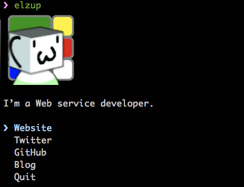

# elzup [](https://badge.fury.io/js/elzup) [](https://travis-ci.org/elzup/elzup)

> The [elzup](https://elzup.com) CLI



## Usage

```
$ npx elzup
```

## Built with

* [ink](https://github.com/vadimdemedes/ink) - React for interactive command-line apps
* [terminal-image](https://github.com/sindresorhus/terminal-image) - Display images in the terminal

## License

MIT © [elzup](https://elzup.com)

## Thanks

This is inspired by <https://github.com/sindresorhus/sindresorhus>
